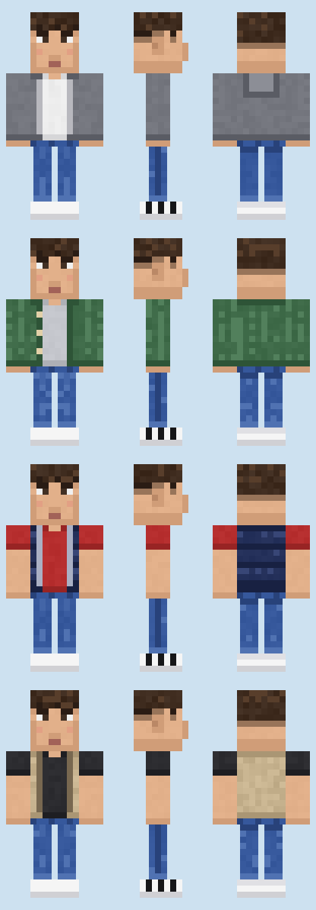

# Opalikhovets — мод для Minecraft 1.21.1 (NeoForge)

Мод добавляет мирного моба **«Опалиховец»** (`opalikhovets:opalikhovets`). Он ведёт себя как житель, но выглядит по-своему и любит фотографировать игроков.



## Возможности

**Внешность** (своя модель и текстуры 64×64):
- голова пропорций жителя (8×10×8) с небольшим носом;
- причёска «кроп»: короткий текстурированный верх, выбритые виски, ровная прямая чёлка (отдельный слой поверх головы);
- кофта или жилетка поверх футболки, 4 варианта (выбирается случайно при спавне и сохраняется в NBT):
  0 — серое худи на молнии и белая футболка, 1 — зелёный вязаный кардиган и серая футболка,
  2 — синий дутый жилет и красная футболка, 3 — бежевый флисовый жилет и чёрная футболка;
- узкие синие джинсы (ноги 3 px вместо 4) с подворотом;
- белые кроссовки (отдельный объёмный кубоид) с тремя чёрными полосами по бокам, без логотипов и товарных знаков.

**Поведение:**
- бродит по миру, обходит воду, смотрит на игроков, открывает двери, убегает от зомби и разбойников, паникует при ударе;
- **ПКМ по мобу**: достаёт телефон (поднятая рука с предметом-телефоном, второй рукой придерживает), 1–2 секунды «целится» в игрока (поворачивает голову и тело к нему), затем «фоткает»:
  - щелчок камеры (слышен всем рядом),
  - искры у телефона,
  - короткая белая вспышка на экране сфотографированного игрока. Если в настройках специальных возможностей включено «Скрыть вспышки молний», вспышка ослаблена;
- кулдаун 10 секунд. ПКМ во время кулдауна — недовольное «хм» жителя;
- если его ударить или игрок отойдёт дальше 16 блоков, съёмка прерывается.

**Звуки** — собственные звуковые события (`opalikhovets:entity.opalikhovets.*`) с субтитрами. Через `sounds.json` они ссылаются на ванильные звуки: голос жителя с более высоким тоном, `item.spyglass.use` на доставание телефона, `ui.button.click` на щелчок камеры.

**Прочее:**
- яйцо призыва во вкладке «Яйца призыва» творческого режима;
- естественный спавн (`MobCategory.CREATURE`, вес 6, группы по 1–2) на траве или песке при освещённости выше 8. Биомы: равнины, подсолнечные равнины и все биомы с деревнями (`#minecraft:has_structure/village_*`): луг, пустыня, саванна, заснеженные равнины, тайга. Список задаётся тегом `data/opalikhovets/tags/worldgen/biome/spawns_opalikhovets.json`, спавн — через `neoforge:add_spawns` biome modifier;
- предмет «Телефон» во вкладке «Инструменты» (декоративный);
- локализация `en_us` и `ru_ru`.

## Требования

- JDK 21
- Интернет при первой сборке: Gradle скачивает NeoForge с `maven.neoforged.net` и Minecraft с серверов Mojang

Версии: Minecraft 1.21.1, NeoForge 21.1.x (см. `gradle.properties`), ModDevGradle 2.0.x, Gradle 8.14.3 (wrapper), официальные маппинги Mojang (без Parchment).

## Сборка и запуск

```bash
./gradlew build        # jar появится в build/libs/opalikhovets-1.0.0.jar
./gradlew runClient    # клиент Minecraft с модом (dev-окружение)
./gradlew runServer    # выделенный сервер
```

Под Windows вместо `./gradlew` используйте `gradlew.bat`.

Готовый jar кладётся в папку `mods` клиента или сервера с установленным NeoForge 21.1.x для Minecraft 1.21.1.

Проверка в игре:
1. `./gradlew runClient`, создать мир в творческом режиме.
2. Взять «Яйцо призыва опалиховца» во вкладке «Яйца призыва» или выполнить `/summon opalikhovets:opalikhovets`.
3. Нажать ПКМ по мобу.

## Текстуры

Все PNG генерируются скриптом на чистом Python без зависимостей:

```bash
python3 tools/generate_textures.py
```

Скрипт пишет:
- `src/main/resources/assets/opalikhovets/textures/entity/opalikhovets/opalikhovets_{0..3}.png` — 64×64, по одной на вариант одежды;
- `src/main/resources/assets/opalikhovets/textures/item/phone.png` — 16×16;
- `docs/preview.png` — ортографическое превью.

UV-раскладка описана в начале скрипта и в `OpalikhovetsModel`. Левые руку, ногу и кроссовок модель зеркалит с правых.

## Структура

```
src/main/java/com/vinegretonline/opalikhovets/
  OpalikhovetsMod.java            — точка входа, регистрация
  registry/ModEntities.java       — тип сущности, атрибуты, правила спавна
  registry/ModItems.java          — яйцо призыва, телефон, творческие вкладки
  registry/ModSounds.java         — звуковые события
  entity/OpalikhovetsEntity.java  — моб: ИИ, варианты, ПКМ, кулдаун, NBT
  entity/ai/TakePhotoGoal.java    — цель «достать телефон → прицелиться → фото»
  network/                        — пакет S2C «вспышка», регистрация payload
  client/model/OpalikhovetsModel.java       — модель, слой, анимация руки с телефоном
  client/renderer/OpalikhovetsRenderer.java — рендерер, варианты текстур, предмет в руке
  client/PhotoFlashOverlay.java   — GUI-слой белой вспышки
  client/ClientModEvents.java     — регистрация слоя модели, рендерера и GUI-слоя
src/main/resources/
  assets/opalikhovets/  — lang, sounds.json, модели предметов, текстуры
  data/opalikhovets/    — biome modifier и тег биомов для спавна
src/main/templates/META-INF/neoforge.mods.toml — метаданные мода
tools/generate_textures.py — генератор текстур
```
